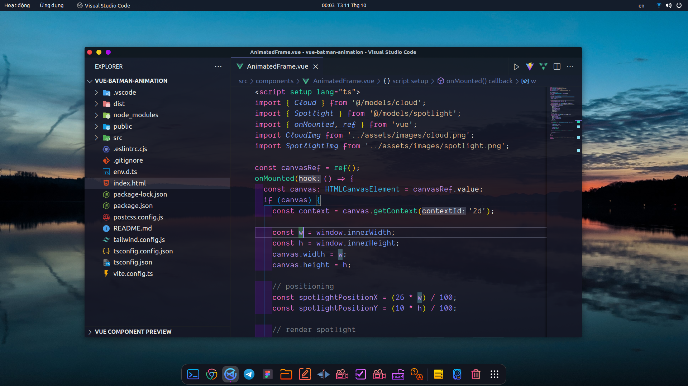

# VS Code Custom Color Theme

## Usage:
- Download file [style.css](styles.css)
- Install extension [Custom CSS and JS Loader](https://marketplace.visualstudio.com/items?itemName=be5invis.vscode-custom-css)
- In VSCode, open ``setting.json`` and import value: ``"vscode_custom_css.imports": ["<path_to_styles.css>"]``
- Finally, press `Ctr + F + P` and enter command `Reload Custom CSS and JS`

## Other extensions:
- Theme: [Evondev Dracula](https://marketplace.visualstudio.com/items?itemName=evondev.dracula-high-contrast)
- Icon: [Material Icon Theme](https://marketplace.visualstudio.com/items?itemName=PKief.material-icon-theme)
- Indent color: [indent-rainbow](https://marketplace.visualstudio.com/items?itemName=oderwat.indent-rainbow)
- Transparent: [GlassIt-VSC](https://marketplace.visualstudio.com/items?itemName=s-nlf-fh.glassit)